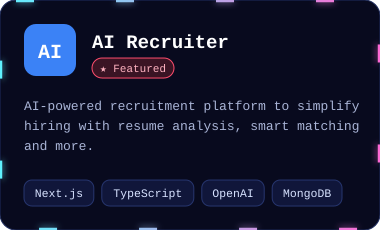
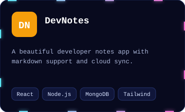
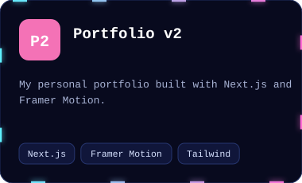
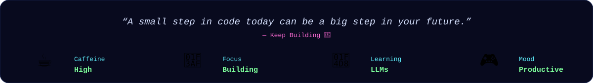

<!-- 👇 Replace brahamtech everywhere (Find & Replace) -->

<table>
<tr>
<td valign="top"></td>
<td valign="top"></td>
</tr>
</table>

<table>
<tr>
<td></td>
<td></td>
<td></td>
</tr>
</table>

<picture>
  <source media="(prefers-color-scheme: dark)" srcset="https://raw.githubusercontent.com/brahamtech/brahamtech/output/github-snake-dark.svg">
  
</picture>

